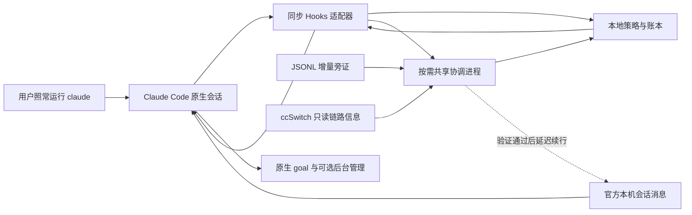

# V2 架构判断：让 Claude Code 长任务安全、有效地继续

研究日期：2026-09-14。本文是研究与架构决策，**不是已经实现的能力说明，也不是立即开始开发的指令**。本轮只交付本文。

## 1. 结论与产品边界

建议把项目从“异常检测与评分器”重设计为 **Claude Code 的任务连续性扩展**：一次初始化后，用户仍然直接运行 `claude`；利用官方执行边界，在能够确认原任务尚未完成、没有用户暂停意图、没有未决副作用时，做有限的纠偏或续行，并检查是否重新产生有效进展。

推荐的组成是：**官方 Hooks 接入 + 本地确定性决策与持久化账本 + 按需启动的单用户共享协调进程**。续行优先在当前回合边界完成；延迟续行只考虑官方本地会话消息通道，并以真实 Windows 验证通过为前提。协调进程负责事件、预算和定时器，不接管 Claude Code 的模型循环，不另造 Gateway，也不作为第二套 Claude 进程管理器。

这不是“只装一个 Hook 就能永不停止”。可靠性至少有四个不同问题：请求能否正确完成、会话能否继续、下一步是否安全、任务是否有进展。任何一层失效，都可能表现为“卡住”。项目不能用一个分数或一句“继续”替代这四个判断。

具体决策：

1. **复用最新 Claude Code，而不是复制它。** `/goal` 已经覆盖一部分持续执行、完成判断、后台任务跟进和失败重试。原生后台会话已有管理进程。Watchdog 应补足进展判断、恢复边界和副作用核对。
2. **先处理活会话中可控制的异常。** 正常停止前的遗漏工作、完整回合的连续空响应、工具边界上的重复失败，具有可用干预点；任意时刻挂死、进程退出、终端关闭后的透明复活，不属于最小 V2 的可靠承诺。
3. **默认不自动切模型、切路由、改协议、清上下文或重放命令。** 这些动作可能改变权限、费用、历史解释和副作用，是另一类控制问题。
4. **恢复成功必须有新证据。** 发出了消息、模型又开始输出、调用了一个工具，都不能单独算成功。
5. **未知状态停止自动恢复，不妨碍用户正常使用 Claude。** 无法确认取消意图、工具执行结果或会话身份时，给出简短说明和可续接信息，不通过自动化猜测。

最重要的现实限制：**“保持原生交互习惯”“任何位置都可强制恢复”“绝不误恢复或重复副作用”目前无法同时保证。** 本方案优先前者及安全边界，对无法控制的中断明确降级。如果用户将来要求终端消失后也持续执行，应另行评估官方后台会话或自有运行时；不能把这项要求隐藏在普通 Hook 插件的宣传里。

## 2. 研究范围、版本与证据强度

### 2.1 本轮核验的基线

| 对象 | 本轮观察 | 解释范围 |
|---|---|---|
| 当前仓库 | HEAD `3b1a193`；Python 3.11+，V0.1；阅读源码、配置、文档及测试/样本 | 仓库能力以实际调用路径为准，不以历史报告描述代替 |
| Claude Code | 最新公开 Release 为 **v2.1.270**，发布于 2026-09-12 19:45 UTC | 官方文档是滚动文档；不代表用户机器已安装此版本 |
| ccSwitch | 最新公开 Release 为 **v3.20.3**，发布于 2026-09-11 16:10 UTC | 转换器分析固定到该 tag；不把 main 未发布代码算作用户已获得的能力 |
| 真实问题 | 官方 GitHub Issues、合并 PR、源码和报告者的对照实验 | 本轮未在用户账户、实际 Provider 或生产会话中复现 |

版本来源：[Claude Code v2.1.270](https://github.com/anthropics/claude-code/releases/tag/v2.1.270)、[ccSwitch v3.20.3](https://github.com/farion1231/cc-switch/releases/tag/v3.20.3)。Claude Code 的公开仓库提供发布信息、问题和插件等，**不能据此声称已经审计完整 CLI 内部实现**。

本文区分三种证据：官方文档/已发布实现说明“设计上提供什么”；Issue 说明“有人在特定条件下遇到什么”；本文的架构建议说明“据此应如何设计”。Issue 关闭不等于根因确认，PR 合并不等于所有相似症状消失。未找到稳定控制契约的能力，列为实验门槛，而不是自行补出接口。

### 2.2 纠正 V0.1 报告中的因果判断

历史报告 [v0.1-final-report.md](reports/v0.1-final-report.md) 中，样本确实支持“承诺下一步后结束”“工具返回后没有有效继续”等现象，但以下推理应降级：

- `chatcmpl-*` ID 是兼容实现的线索，不能单独证明实际协议转换链；ID 可以被保留或仿造。
- JSONL 缺少 `stop_reason`，不能证明线上 SSE 缺少结束事件；聚合、落盘和显示是不同观察层。
- usage 为零或骤降，可能涉及统计口径、缓存、缺字段或转换，不能直接证明模型实际只收到了短上下文。
- 模型说“收到了空消息”是模型陈述，不是独立测量；thinking-only、空文本块和完整空回合也不能合并计数。
- `<synthetic>` 不应直接记为真实上游模型；同一时间附近发生切换和异常，只能建立相关性。

因此，不能沿用“根因已确认是中转/公益站”或“现有生态都只会按键重试”的结论。本轮公开材料已显示 CLI 自身、转换器、历史构造和恢复机制都可能出错。

## 3. V0.1 为什么需要重设计

V0.1 的价值是把若干真实异常变成了可阅读的事件和样本。问题在于，其核心仍是“日志 → 归一化 → 分数 → 通知/继续提示”，并未形成可验证的恢复闭环。

| 实际实现 | 对真实目标的影响 | V2 处理 |
|---|---|---|
| [CLI](../src/ccs_watchdog/cli/main.py) 的 `watch` 启动时选定 transcript，`--auto-resume` 主要打印提示 | 需要额外操作，也不能证明会话已经恢复 | 从日常入口移除手动 watch；保留诊断用途即可 |
| [Hook runner](../src/ccs_watchdog/hooks/runner.py) 已可选地阻止 Stop | 已有低打扰入口，不应把整个仓库误判为完全不能续行 | 保留接入经验，替换控制决策 |
| runner 按 score 决定 block，没有落实 Verdict 的 `manual_review` 动作；StopFailure 走同一判断路径 | 高疑似不等于可安全恢复；不同 Hook 的控制语义混在一起 | 先判动作资格，再判异常；事件类型分别处理 |
| [状态机](../src/ccs_watchdog/state/machine.py) 用一个 `pending_tool` 布尔值；任一结果便清除；idle 也清除 | 并行工具未完成时可能被误判可续行 | 按 tool-use ID 和批次跟踪未决集合 |
| `human_interrupted`、`awaiting_user` 没有真正进入有效的置位路径 | 存在字段不代表取消/等待保护已经工作 | 可靠事件来源是开发门槛；Unknown 禁止自动唤醒 |
| [评分器](../src/ccs_watchdog/scoring/score.py) 将 future-action 文本、缺字段、空块累加 | 容易误伤正常说明、流式片段或模型内部内容 | 只有完整边界上的证据才能触发动作 |
| [Replay](../src/ccs_watchdog/replay/engine.py) 在 Stop 时重读全文；保存的是同一可变 snapshot 引用 | 长会话成本增长；历史尾部比较并非独立快照 | 热路径增量状态；离线回放使用不可变事件/快照 |
| [预算](../src/ccs_watchdog/hooks/budget.py) 无事务地读改写 JSONL；失败静默；一小时后返还次数 | 并发、崩溃或账本不可写时可能失去约束；没有进展也会获得新预算 | 持久化事务预留；预算绑定原始任务和异常，不靠时间自动洗白 |
| [配置](../src/ccs_watchdog/config/defaults.py) 中部分冷却/空响应/idle 参数未接入实际判断；Replay 的切换年龄保持 `None` | 界面和命名暗示的控制能力超过实际能力 | 只暴露已经验证、真正生效的参数 |
| [ccSwitch reader](../src/ccs_watchdog/provider/ccswitch.py) 读取配置/日志快照 | 当前选中 Provider 不能说明每次请求实际去了哪里 | 配置快照与请求归因分开，缺失就写 Unknown |
| reader、日志和测试以本地格式及样本为主 | 没有证明升级、文件替换、并发窗口、实际恢复及脱敏的完整性 | 保留样本价值，不能把历史测试通过当可靠性保证 |

这些并非本轮要顺手修复的 bug 清单，而是证明需要改变控制模型。尤其不能继续在现有 `score >= threshold` 后接上真正的自动输入，让原本只影响报告的误判直接影响工作区。

## 4. 最新生态已经提供什么

### 4.1 Claude Code：先利用现成的长任务能力

`/goal` 已能持续推进给定完成条件；评估器读取对话，不独立检查文件或运行命令。恢复会话时可保留目标，但统计基线会重置；其“若干轮无工具使用”防循环也不等于验证任务进展。条件里的时间/轮数限制由模型判断，不能替代外部硬预算。[官方 Goals 文档](https://code.claude.com/docs/en/goal)

v2.1.269 又改进了目标遇到 API/连接错误时的退避和暂停，以及旧中断会话错误自动重跑、上下文压缩卡住等问题。v2.1.267 修复了某些 resume 路径多插入 Continue、大 transcript 恢复丢失并行工具和 Hook 内容等问题。v2.1.270 修复长会话中只读 git 命令意外要求权限的回归。[v2.1.269](https://github.com/anthropics/claude-code/releases/tag/v2.1.269)、[v2.1.267](https://github.com/anthropics/claude-code/releases/tag/v2.1.267)、[v2.1.270](https://github.com/anthropics/claude-code/releases/tag/v2.1.270)

**架构判断：** 活跃 `/goal` 应拥有“是否继续下一回合”和其原生重试的主导权。扩展不再并列发送另一份继续消息；只在有证据时纠正无进展行为、保护工具边界。原生目标暂停不能自动被解释为需要 Watchdog 接管。

普通 `claude` 也应自动获得有限保护，但不能悄悄把每个问题改成 `/goal`。Hook 的附加上下文不是用户原始输入替换器；消息中的斜杠文本也不能被假定为可执行命令。因此，“自动把任何输入变成原生目标”的无感方案没有在本轮获得足够依据。用户愿意使用 `/goal` 时可获得更强原生能力，**它不是使用本扩展的必选步骤**。

### 4.2 Hooks：关键在执行边界，不在 Hook 数量

当前官方契约需要保留的最小事实如下，具体字段以开发时文档和对应版本实测为准：

| 边界 | 可用能力及关键限制 |
|---|---|
| SessionStart / UserPromptSubmit | 提供会话与输入上下文；后者不替换原提示；`initialUserMessage` 的启动注入限非交互模式 |
| PreToolUse | 可在实际工具前拒绝；工具名/schema 校验失败可能先于该 Hook |
| PostToolUse / PostToolUseFailure | 结果观察；成功后的副作用不能撤销；取消正在运行的工具并不保证触发 Failure Hook |
| PostToolBatch | 整批工具结束、下一次模型请求之前，可反馈或停止循环 |
| Stop | 正常结束时可要求续行；不是用户中断/API 失败事件；连续阻止有宿主上限 |
| StopFailure | 可观察错误，不能靠 `decision:block` 让失败回合继续 |
| async / asyncRewake | 普通异步输出等待下一轮；后者具备特定唤醒机制，不能由此推定所有失败事件均可唤醒 |

来源：[Hooks reference](https://code.claude.com/docs/en/hooks)。V0.1 安装器使用的 executable + `args` 形式在当前文档中有依据，不能误判为无效格式。

**架构判断：** 同步 Hook 只做有界本地决策；不在 Stop 中整段重放 transcript、等长网络请求或运行第二个大模型。自动续行优先放在宿主已经交付的安全边界。`stop_hook_active` 是全局续行迹象，不是“这次一定由本扩展触发”的归属证明；仍需本扩展自己的 incident ID 和预算。StopFailure 的通知与后续发起新回合必须是两步，不伪装成同一种 block。

### 4.3 官方本地消息：存在免按键的通道，但不是万能遥控

最新文档提供会话本地 inbox：原生 Windows 使用命名管道，Hook 可获得 `CLAUDE_CODE_MESSAGING_SOCKET` 和 token；Windows 连接必须先认证。消息可启动空闲会话的新回合，忙时在工具调用之间交付，不打断运行中的工具。显式 inbound `hold/refuse` 必须遵守。本机传输不经过 Anthropic 消息中继；原生 Windows 的最低版本及后续 Provider 可用性变化见文档。[Cross-session messaging](https://code.claude.com/docs/en/cross-session-messaging)

**架构判断：** 这是比 SendKeys、终端注入、重开 `claude -p --resume` 更值得验证的延迟续行入口。但公开页面不能替代完整的消息请求/确认、去重、撤销与取消竞态契约。最小 V2 不应依赖猜出的私有消息格式。

必须验证：来自本会话 Hook 的凭据能否安全交给共享协调进程使用；发送是否区分拒绝/暂存/交付；用户取消后已排队消息能否失效；投递产生的新回合是否有足够事件能再次检查恢复资格。**仅“消息发送成功”不能证明任务开始，更不能证明恢复成功。** 验证未通过时，关闭延迟自动唤醒，仍可保留同步边界上的保护。

### 4.4 后台管理、Resume 与 Checkpoint：不要重复建造

Claude Code 原生 agent view/后台会话已有自动启动的管理进程和会话生命周期处理，覆盖 Windows；部分被停止的会话会保持 Stopped，不能概括成“杀掉就自动复活”。普通前台会话也不会因为安装扩展就自动变为原生后台任务。[Agent view](https://code.claude.com/docs/en/agent-view)

`resume` 恢复对话不等于恢复工具进程。文件 checkpoint 的覆盖有边界，不能回滚 Bash 造成的任意文件变动、数据库、网络调用或其他会话的修改。[Checkpointing](https://code.claude.com/docs/en/checkpointing)

**架构判断：** 不开发第二套前台/后台 Claude 生命周期系统；不自动 rewind、reset 或回放全部工作。进程已经退出时记录准确 session ID 和未决动作，等用户下次正常启动/选择原生 resume；只有显式采用官方后台工作流时才借其管理能力。SDK 的会话控制适合“我们拥有运行时”的另一种产品，不能直接套到任意已打开的交互 CLI 上。[Agent SDK sessions](https://code.claude.com/docs/en/agent-sdk/sessions)

### 4.5 ccSwitch：已经是路由与转换层，不应再造一个

固定 v3.20.3 源码可以确认 Claude 适配器支持 `anthropic`、`openai_chat`、`openai_responses`、`gemini_native` 分支，分别调用实际转换路径。其路由器和 forwarder 已管理供应商队列、重试及熔断。不能假设所有上游都是 Anthropic 原生兼容接口。[Claude adapter](https://github.com/farion1231/cc-switch/blob/v3.20.3/src-tauri/src/proxy/providers/claude.rs)、[Provider router](https://github.com/farion1231/cc-switch/blob/v3.20.3/src-tauri/src/proxy/provider_router.rs)、[Forwarder](https://github.com/farion1231/cc-switch/blob/v3.20.3/src-tauri/src/proxy/forwarder.rs)

需要特别注意：

- 请求转换、响应转换、流式转换是不同路径；“支持 Responses”不是完整兼容证明。
- Chat 流可能在自然 EOF 时做收尾；Responses 转换器则对某些截断的工具/推理内容输出错误。转换后的终止状态未必等同于上游确实发送了完整终止事件。[Chat streaming](https://github.com/farion1231/cc-switch/blob/v3.20.3/src-tauri/src/proxy/providers/streaming.rs)、[Responses streaming](https://github.com/farion1231/cc-switch/blob/v3.20.3/src-tauri/src/proxy/providers/streaming_responses.rs)
- Gemini 路径使用有界、内存中的 shadow state 保存会话相关信息。代理重启、切换供应商、长历史淘汰后的往返需要验证；不能只检查首轮问答，也不能据此断言所有恢复必然失败。[Gemini transform](https://github.com/farion1231/cc-switch/blob/v3.20.3/src-tauri/src/proxy/providers/transform_gemini.rs)、[Gemini shadow](https://github.com/farion1231/cc-switch/blob/v3.20.3/src-tauri/src/proxy/providers/gemini_shadow.rs)
- 配置接管、代理中的热切换、CLI 启动时加载的环境不同步，是必须区分的状态。[官方路由指南](https://github.com/farion1231/cc-switch/blob/v3.20.3/docs/guides/claude-codex-routing-guide-zh.md)

**架构判断：** 复用 ccSwitch 的链路治理，Watchdog 只读集成；不再实现协议转换、备用供应商调度或嵌套网络重试。预防优先于续行：已知转换缺陷应升级并验证已修复链路，不能依靠重复提示掩盖。

## 5. 重复、退化与突然中断：有关联，但没有统一根因

### 5.1 先把五个维度分开

| 维度 | 应记录的含义 | 不能代替什么 |
|---|---|---|
| Model | 请求模型、服务端返回模型、别名解析、大小模型角色 | 不能由供应商名称推导实际模型 |
| Provider | 接收请求的服务实体/配置身份；其背后可能仍有多家服务 | 不是协议名称，也不必是最终模型运行者 |
| Route | 一次请求实际经过的端点序列、配置版本、重试/故障转移尝试 | 不能用 GUI 当前选中的卡片代替历史路由 |
| Protocol | 每一跳的请求/响应契约及流式语义 | 同名兼容端点不保证语义等价 |
| Conversion Layer | 谁转换了哪些内容，版本与方向 | 可能有零层、一层或多层，不能统称 Provider |

例如：`Claude Code → Anthropic Messages → ccSwitch → OpenAI Responses → 某 Gateway → 另一种上游协议 → Model`。这个例子是需要允许的数据模型，不是对用户当前链路的断言。

最小请求证据应区分“配置的预期路由”和“实际观察的路由”。后者若拿不到请求级 ID、实际 upstream 和 attempt 信息，就标 Unknown。ID 前缀、HTTP 状态、模型标签和时间邻近只作为旁证。凭据、完整提示、工具输出不应进入默认遥测。

### 5.2 已知机制与可观察规律

| 机制 | 为什么既可能重复，也可能停止 | 应观察/验证什么 |
|---|---|---|
| 历史角色/回合边界错误 | 相邻 assistant 被拆成两个示范回合，模型可能学习重复进度播报，也可能把播报当完成 | 对比转换前后的回合、commentary、reasoning 与 tool call 归属 |
| 工具结果或调用关联丢失 | 模型看不到结果而重试；也可能认为工具不可用或生成普通文本 | tool-use/call ID、结果完整性、顺序、并行批次 |
| 流被截断或终止原因错误映射 | 部分结果被当完整结束；重试又把已交付片段追加到历史 | 首字节、终止帧、错误事件、聚合结果、重试 attempt 边界 |
| 上下文压缩、恢复、模型切换 | 约束/已完成事实/工具定义缺失，导致旧工作重做或提前放弃 | 压缩/恢复前后证据、工具定义、模型角色和上下文声明 |
| 模型与解码本身退化 | 重复内容进一步诱导重复；即使完全没有代理也可能发生 | 相同合法请求在稳定链路下的重复率、采样条件、历史长度 |
| 多层重试/多重续行器 | 同一失败触发 CLI、代理和 Watchdog 多次工作；也可能预算耗尽停机 | 每层的重试所有者、计数、退避、请求与操作身份 |
| 宿主/终端/Hook 故障 | 非用户触发的中断、Hook 自循环或恢复事件缺失 | 平台、版本、事件来源；不要仅相信终端上的一句错误文本 |

协议依据：Anthropic 的流式起始空 content 本来正常，流中也可能在 HTTP 200 后报错；完整结束必须按协议理解，不能见空块就续行。[Anthropic streaming](https://platform.claude.com/docs/en/build-with-claude/streaming)

Anthropic 官方还明确讨论了工具结果之后的空 `end_turn`，可能与历史中工具结果后的用户文本、已完成 assistant 回放有关；`end_turn` 是回合结束信号，不是原任务验收。[Handling stop reasons](https://platform.claude.com/docs/en/build-with-claude/handling-stop-reasons)

Responses 的工具调用及 reasoning items 有自己的关联和回传要求，不能当普通 Chat 文本拼接。[OpenAI function calling](https://developers.openai.com/api/docs/guides/function-calling) Gemini 的 `generateContent` 中签名位于 part 元数据；当前 Interactions API 的独立 thought steps 是另一种结构，不能因文档更新而混用协议。[Gemini thinking](https://ai.google.dev/gemini-api/docs/thinking)

模型自身重复的理论线索可参考 [Learning to Break the Loop](https://arxiv.org/abs/2206.02369) 和 [The Curious Case of Neural Text Degeneration](https://arxiv.org/abs/1904.09751)。它们支持“历史和生成策略可能造成重复”的机制，不是对当前闭源模型、用户上游或某次事故的根因证明。

### 5.3 值得保留的真实案例

以下状态为本轮访问时状态。不同平台、产品和版本的案例只支持对应范围，不混成一张“第三方不可靠”的排行榜。

| 案例与状态 | 实际发现 | 架构含义 |
|---|---|---|
| ccSwitch [#5860](https://github.com/farion1231/cc-switch/issues/5860)，已关闭，2026-07-29 提交 | Codex/Chat 转换链中，报告者把相邻 assistant 合并后，小样本循环从 6/8 降至 0/8；不同托管端点差异明显 | 有直接历史结构对照线索；数字是报告者样本，非本轮复现，也非通用故障率 |
| ccSwitch [#6529](https://github.com/farion1231/cc-switch/issues/6529) 与已合并 [PR #7280](https://github.com/farion1231/cc-switch/pull/7280)，v3.20.3 已包含 | Responses→Chat 将 commentary 和紧随工具调用拆开，使长任务在进度播报后提前 stop；修复合并相邻片段并处理 reasoning 重复 | 与上一例有共同的历史边界机制；该修复针对 Codex 路径，不能直接声称修复了所有 Claude 停止 |
| ccSwitch [#5028](https://github.com/farion1231/cc-switch/issues/5028) 与已合并 [PR #7227](https://github.com/farion1231/cc-switch/pull/7227)，v3.20.3 已包含 | Windows Claude 链路的空 reasoning 占位导致大量空 thinking 块和文本碎片 | 能确认转换器缺陷；空 Thought 刷屏不等于完整空回合，更不等于所有推理都丢失 |
| ccSwitch [#1234](https://github.com/farion1231/cc-switch/issues/1234)，已关闭 | Claude 第三方长任务突然停止，报告有直连对照，但证据不足以确立同一个根因 | 相同外观不应自动套用另一个 Issue 的补丁 |
| ccSwitch [#6127](https://github.com/farion1231/cc-switch/issues/6127)，开放 | Windows 关闭/切换路由后连接仍异常的报告 | 需要区分已写配置、运行中环境和实际请求路线 |
| Claude Code [#86427](https://github.com/anthropics/claude-code/issues/86427)，已关闭 | 2.1.231 空/畸形 HTTP 200 响应报告 | 客户端错误提示建议检查网关，不是网关有罪的证明 |
| Claude Code [#86896](https://github.com/anthropics/claude-code/issues/86896)，已关闭 | macOS/tmux 下报告非人为 ESC 导致“用户中断工具” | 中断文案不一定还原物理输入来源；自动化仍应把取消歧义视为禁止恢复 |
| Claude Code [#77686](https://github.com/anthropics/claude-code/issues/77686)，已关闭 | Stop 连续阻止达到上限后结束，曾难区分完成与被强制结束 | 当前文档已有上限说明；宿主停止不代表验收通过 |
| Claude Code [#91087](https://github.com/anthropics/claude-code/issues/91087)，开放 | Windows Remote Control 崩溃恢复后会话孤立、消息长期排队 | 这是 Remote Control 案例；说明“有记录/能排队”不等于有活运行者 |
| Claude Code [#93742](https://github.com/anthropics/claude-code/issues/93742)，开放 | 2.1.269 Linux 上 `/model` 写回旧设置、覆盖 Hook 的报告 | 安装成功不能视为永久健康；需要发现保护失效，而不是循环覆盖用户配置 |
| Claude Code [#94251](https://github.com/anthropics/claude-code/issues/94251)，2026-09-14 开放 | 2.1.270 macOS 交互模式显示的工具前文字未完整落入 JSONL 的报告 | 新鲜单报告，尚不能泛化；但足以否定“JSONL 永远等于全部运行状态”的设计假设 |

因此，用户观察到的“切换附近更容易出现重复/停止”值得调查，**但只能作为分层对照实验的入口**。应固定任务、历史、模型、采样及工具定义，每次只改变一段路线或一个转换器；同时保留正常对照。只有相同请求/响应边界证据才能把链路变化和异常建立更强因果关系。

## 6. 考虑过的产品方向与最终选择

| 方向 | 获得什么 | 代价/缺口 | 决策 |
|---|---|---|---|
| 只使用新版 Claude Code + `/goal` | 成本最低，原生持续回合、部分重试和完成评估 | 无法可靠判断重复工具是否有进展、未知副作用；普通任务不一定启用目标 | 必须作为基线，先证明扩展有增量价值 |
| 纯 Stop Hook / Ralph 式循环 | 安装一次，不改变 `claude`，可在正常停止前续行 | 无法接管所有错误退出/挂死；自身可能无限循环 | 只采用有界边界纠偏，不采用无限完成循环 |
| Plugin 打包 Hooks 与诊断 | 分发、更新、启停体验好 | Plugin 本身并不创造进程控制权或可靠唤醒权 | 可作为后续分发形式，不是运行架构答案 |
| Hooks + 按需共享协调进程 | 原生命令、自动绑定、多窗口、持久预算、延迟事件处理 | 需要可靠 IPC、取消语义；新增进程也会故障 | **推荐；协调进程保持小而确定** |
| `claude` 透明 Wrapper / ConPTY Supervisor | 可拥有进程、终端输入、输出及退出边界 | Windows 信号/快捷键/TTY/升级/路径兼容复杂；进程所有权也不能实现副作用 exactly-once | 不作为默认；仅在官方通道验证失败且产品愿意接受此代价时重新决策 |
| 常驻系统服务 | 可独立于终端存活 | 安装权限、跨用户安全、升级卸载及进程归属更复杂；仍不懂任务 | 不做最小 V2 |
| 新 Gateway / 修改 ccSwitch | 可看到协议原始帧和请求重试 | 对直连无效；接管凭据；重复已有能力；看见请求也不等于安全执行工具 | 只读适配和推动上游修复，不接管网络 |
| Agent SDK / 自有 Agent Runtime | 可拥有调度、持久化、工具与取消语义 | 用户不再使用原来的交互 CLI；维护面显著扩大 | 独立产品方向，不在本项目 V2 偷换目标 |

### 6.1 相似项目中值得借鉴、不能照搬的东西

[claude-auto-retry](https://github.com/cheapestinference/claude-auto-retry) 展示了 shell 层保持 `claude` 入口、tmux 定向投递和退避；[Windows 版本](https://github.com/reglisseblip/claude-auto-retry-windows) 使用 psmux；[另一实现](https://github.com/zhangfeiyang/claude-auto-retry) 使用 Hook、守护进程和 SendKeys。这些项目证明自动重试有需求，也给出不同的进程生命周期做法；本轮没有获得其“可靠判断有效进展、避免所有重复副作用”的验证证据。终端文本和焦点不应成为本项目的主控制契约。

官方 [Ralph Wiggum 插件](https://github.com/anthropics/claude-code/tree/main/plugins/ralph-wiggum) 用 Stop 反馈延续任务。完成标记主要来自模型输出，未设次数时循环可以很长。可借鉴简单反馈，不能把 completion promise 当独立验收，也不能解决所有网络、权限和进程故障。

[Gemini CLI loopDetectionService](https://github.com/google-gemini/gemini-cli/blob/main/packages/core/src/services/loopDetectionService.ts) 同时处理重复工具、文本和更高层判断；其阈值是特定运行时的设计，不应复制成跨模型定律。早期 [#5276](https://github.com/google-gemini/gemini-cli/issues/5276) 的循环警告报告提示：用户需要知道为何被停下，重复判定本身也会造成困扰。

[OpenHands PR #4332](https://github.com/OpenHands/software-agent-sdk/pull/4332) 采用重复错误先提示、继续失败再 STUCK 的做法。该 PR 的审查还发现：如果后续只有空/推理事件，没有新错误，冻结的错误计数也可能重复触发提示。修复引入“最近已提示的错误事件”判断。**借鉴点是按事件去重，而不是每次看到同一个坏状态就再发一次消息。**

Anthropic 的 [长任务 Harness 文章](https://www.anthropic.com/engineering/effective-harnesses-for-long-running-agents) 强调可核验的分步工作和交接；[后续 Harness 设计文章](https://www.anthropic.com/engineering/harness-design-long-running-apps) 也说明上下文策略依模型和任务而变，不能机械定时清空。官方 [cwc-long-running-agents](https://github.com/anthropics/cwc-long-running-agents) 是活动示范、非持续维护的成品：可以借其验收条件、证据和独立评估思路，不采用其自动提交等超出当前用户授权的行为。

[Temporal Activities](https://docs.temporal.io/activity-definition) 的启示是将外部副作用显式建模，并依赖幂等键/核对来面对重试；“执行了但未记录完成”的窗口依然存在。[LangGraph persistence](https://docs.langchain.com/oss/python/langgraph/persistence) 依赖自己拥有的状态和 checkpointer；给不透明 CLI 外面加一层文件，不能自动获得同等 durable execution。最小 V2 不引入这两套框架，但采用明确状态、持久预算和操作核对。

## 7. 推荐架构：宿主拥有执行，扩展拥有恢复资格

图中是职责，不要求每个框一个服务。普通同步动作不依赖协调进程往返成功；策略可在 Hook 进程中用短事务完成。共享协调进程处理跨回合定时器、事件汇聚和故障记录。所有自动恢复共用同一本预算账本，不能有 Hook 自己的一套计数和后台自己的另一套计数。

### 7.1 五个必要模块

**宿主适配器。** 只解释已验证版本的事件契约，给出会话身份、观察完整性、可用控制边界；Unknown 与空集合严格区分。JSONL 是补充材料，不是唯一真相，更不直接修改 JSONL。模型切换、压缩、恢复只在收到可靠证据时入账；代理内部切换另由请求归因提供。

**会话与任务账本。** 保存本扩展拥有的事实：来源事件、工具未决项、原任务身份、恢复次数、暂停原因、证据摘要。它不是 Claude 内部 session registry 的替代品。一个 session 中可有多个先后的人类任务；一次原任务也可能跨 resume。恢复预算随任务延续，不因 PID/小时/会话恢复而重置。

**恢复资格决策器。** 输入证据与权限边界，输出“无动作、边界纠偏、等待原生重试、候选延迟续行、需人工核对”等少量动作。不是输出一个 0–100 分供调用者自行猜含义。疑似程度和可恢复性分别表达：很确定发生错误，也可能完全不适合自动恢复。

**恢复投递器。** 同步 Hook 和官方本地消息是两种不同传输。统一按 incident/action ID 预留预算、记录发送结果。只用预先定义的小型恢复消息，不运行日志里出现的命令，不修补模型输出的工具 JSON。未知是否已投递时不盲目重发。

**进展验证器。** 对比恢复前后证据，判断是否走出了本次异常，以及是否仍在原任务范围。默认规则和工具结果足够时不额外调用模型；语义判断必须保留不确定性。新增模型评估是可选增强，不能把整个保障机制托付给可能正在退化的同一输出。

### 7.2 身份和事件要求

建议保存以下逻辑身份，不要求立即设计庞大数据库：

- `session_id`、Claude 配置目录/用户配置身份、工作目录及 worktree 身份、会话启动世代；PID 必须结合启动时间，不能单凭可复用 PID。
- 本机消息端点与凭据的关联；凭据只进入受当前用户保护的短期通道，不进入日志、导出包或模型上下文。
- `task_epoch`：源于可确认的人类任务；追问状态、补充约束或一句“继续”通常仍属于原任务。Hook 反馈、恢复消息和工具结果不能冒充新任务或续期授权。
- `agent_id`、父子关系、tool-use ID、batch ID；子代理停止不等于主任务停止，主会话恢复不能误作用于某个子代理。
- 来源事件 ID、偏移/版本、接收时间、事件时间和去重键；文件截断、替换、部分行、重复投递、乱序分别处理。
- `incident_id`、`recovery_action_id`、`progress_epoch` 和未决副作用集合。

配置中的 Provider 名称、transcript 最近修改时间、目录编码、窗口标题只能帮助诊断，**不能用来决定控制哪个会话**。同一 cwd 下两个窗口是基本场景，不能要求用户每次手工绑定。

### 7.3 不必用一张巨型状态机描述所有事情

建议分开维护三个维度，然后推导动作资格：

| 维度 | 必要状态示例 |
|---|---|
| 宿主状态 | 活动、工具未决、等待权限/用户、正常回合结束、失败结束、已退出、未知 |
| 任务状态 | 无执行任务、进行中、疑似无进展、已验证完成、用户暂停/取消、阻塞 |
| 恢复状态 | 未尝试、已预留、已发出、交付未知、等待新证据、已验证有效、已熔断 |

这可以避免“进程活着 = 任务在工作”“模型 idle = 应该继续”“新输出 = 恢复成功”等错误映射。状态推导必须能指出来源；不能因为超时就清除尚未返回的工具，也不能因为又有一条 assistant 消息就清掉用户暂停。

### 7.4 谁负责重试，必须只有一个明确答案

| 层级 | 负责内容 | Watchdog 行为 |
|---|---|---|
| Provider/Gateway/ccSwitch | 网络请求、协议转换、已配置的供应商故障转移 | 观察，不能再包一层同类立即重试 |
| Claude Code | 模型/工具回合、权限、原生目标和会话管理 | 尊重正在进行的原生重试、后台任务与目标暂停 |
| Watchdog | 原任务已经停滞后的有界续行和验证 | 只在上两层交出可确认边界后动作 |
| 用户 | 扩大任务、变更授权、取消、接受未决副作用风险 | 消息和模型判断不能代为授权 |

若拿不到原生 goal/重试状态，不能靠“现在没输出”推定其没有在等退避。此时关闭延迟续行；同步干预也限制为明确的工具安全/无进展反馈，避免与原生续行形成双循环。共享协调进程不是让不可靠状态变可靠的魔法。

## 8. 什么叫有效进展，如何识别活着但卡死

### 8.1 四层信号，不能混为一个心跳

| 层次 | 示例 | 可以证明什么 |
|---|---|---|
| 进程活性 | PID 在、IPC 可连 | 进程可能还在，不证明任务能运行 |
| 活动 | token、工具调用、日志增长 | 有活动，不证明有效 |
| 可核对的新证据 | 新诊断定位了未解决原因、读到了新的相关代码、失败测试集合发生有意义变化 | 原任务的某一步可能前进 |
| 验收进展 | 某项既定条件被可信输出/产物满足，原约束仍成立 | 更强的任务进展；仍须确认测试/证据相关且未被篡改 |

没有文件修改不等于没有进展：研究、读代码、定位问题都可能有效。反过来，反复修改同一文件、跑同一个测试、输出不同措辞，都可能毫无进展。退出码 0 也必须对应本任务相关的检查，不能把 `echo done` 当完成证据。

`progress_epoch` 只能由新证据推进；用户输入的新目标另开 `task_epoch`。恢复消息本身、token 增长、重复读取旧内容不返还预算。模型自报“完成 80%”可记录为声明，不可自动成为证据。

### 8.2 循环检测以“同样的动作、同样的结果、没有净进展”为中心

1. **连续工具重复：** 比较工具类型、规范化参数、相关工作区版本、结果摘要；同一工具名不足以判断。`Edit → test → Edit` 若失败原因有变化，不应误当死循环。
2. **短周期循环：** 识别 A→B→A→B 的状态回返，例如反复重新读相同文件并重述同一计划；要求结果和目标证据也未变化。
3. **文本重复：** 在完整消息/回合间比较重复片段和新增信息；排除流式 delta、渲染重复、列表模板、引用原文。单次流内的失控重复可能没有可用 Hook 中断点，见覆盖边界。
4. **重复错误：** 工具参数/schema、相同不存在路径、相同外部错误；同一错误事件只能触发一次纠偏，不能因重复读账本而再次触发。
5. **工具文本化：** 必须存在宿主认可的结构化工具事件才算执行。普通文字里的 `tool_call`、XML 或 JSON 都不能被 Watchdog“修好后执行”。
6. **长时间无证据：** 时间只产生候选异常。已知测试/构建/下载仍在运行、权限等待、后台任务有输出、正常轮询，都应有不同判断。

不推荐首版用一组跨模型的相似度阈值直接杀进程。推荐先采用“明确重复错误/重复操作且无新证据”的窄判定，触发一次有方向的纠偏；复杂语义停滞作为后续实验。对无法确定的慢任务，允许告知停滞风险，不能编造它已经卡死。

### 8.3 恢复必须改变后续行为

恢复反馈只包含：原任务的最小定位、最近一次已确认进展、这次失败/重复的证据、未知结果、一个安全的下一步和停止条件。避免反复发送整段原提示，让模型重新做完所有步骤。

例如，针对重复测试错误，应要求读取刚才失败的具体输出、解释需要改变的假设，然后进行相关核对；针对完整空回合，应在原上下文中请求继续未完成步骤并先检查上个工具结果；针对工具结果未知，应先核对效果，不能直接再执行。

同一纠偏后仍然出现同类循环，不能把提示写得更强硬后无限重复。应停止本扩展的自动恢复，报告“仍未观察到有效进展”及已尝试动作。原生目标如果仍在持续执行，需在可控制边界结束异常循环；若无法结束，应明确保障范围，不能只关闭本扩展计时器就宣布已控制住运行。

## 9. 安全恢复协议与停止条件

### 9.1 动作前必须同时满足的条件

这些是架构要求，**不是声称现有 Hook 已能提供全部数据**：

1. 会话、启动世代、工作区和原始任务身份明确，且任务不是已经完成的问答/咨询。
2. 有已观察到的异常结束或工具批次边界；不是仍在流式输出，也没有未决前台/后台工具。
3. 已排除用户取消、退出、权限拒绝和等待补充信息；相关状态未知时，此条件不通过。
4. 没有已知的原生重试/目标续行在负责同一问题；观察不完整时不安排竞争性唤醒。
5. 上一操作的副作用已确认，或者下一步严格限定为可执行的只读核对。
6. 账本可用，事务中成功预留预算；该 incident 没有尚未确认的投递。
7. 恢复仍在用户原始任务、权限和预算范围内，链路能力满足该工具历史。

任何一项不满足就不自动续行。正常情况下不输出诊断噪声；只有因此无法继续原任务时才给用户一条具体说明。

### 9.2 先核对副作用，后决定是否重做

工具调用至少区分：尚未开始、执行中、已返回且结果可确认、执行结果未知、效果已核验。响应丢失不等于动作失败；返回错误也不必然表示没有局部副作用。

| 上一次动作 | 合理的恢复前核对 | 禁止的捷径 |
|---|---|---|
| Read/Grep/Glob 等已知只读工具 | 同一工作区与输入是否仍有效 | 仅按工具名字相信任意 MCP/Skill/脚本只读 |
| 文件修改 | 检查当前内容、预期修改和原约束；保留用户/其他会话新改动 | 重放整个 patch、自动 reset/checkout/覆盖 |
| Bash/PowerShell/测试脚本 | 核对命令实际行为、进程和外部效果；“测试”也可能写库或部署 | 因为名字像 test 就自动再跑 |
| HTTP 写入、发布、迁移、发送消息 | 查询已有操作 ID/幂等键和服务端状态；无可靠查询则交用户 | 超时后一律重试，或擅自发明上游未支持的幂等键 |
| 未知工具/MCP 调用 | 明确语义和结果之前保持未知 | 由模型声称“安全”就自动放行 |

恢复时的只读核对应通过宿主权限及 PreToolUse 约束实际落实；不能只在提示里写“先检查”。但 Hooks 不是对所有执行渠道的通用安全沙箱，工具覆盖不完整时必须降级。并行工具需等待整个相关批次收敛，不能见到一个结果就恢复主任务。

**本项目不承诺任意外部副作用 exactly-once。** 只能对自己发起的恢复动作去重，并尽力核对宿主工具效果；进程在“外部动作成功、完成记录尚未落盘”之间崩溃，是必须保留的未知窗口。

### 9.3 用户取消是延迟续行的发布门槛

不能以“没有看到取消”代替“确认没有取消”。Esc、Ctrl+C、权限拒绝、关闭窗口、新的人类指令、原生 `/goal clear` 和跨会话消息等可能经不同路径进入宿主。必须通过真实事件测试区分其含义，不能用所有 `role=user` 记录统一续期。

尤其存在竞态：协调进程检查通过 → 用户按停止 → 排队消息到达 → Claude 再次执行。发送前再查一次也不能彻底消除这个窗口。必须有宿主支持的失效/取消机制，或在接收回合真正执行工具前可靠地拒绝已过期恢复；不能假定每条外部消息都会触发 UserPromptSubmit。

**若无法可靠处理这个竞态，最小 V2 关闭异步自动唤醒。** 同步 Stop/工具边界的窄保护仍有价值，但产品说明必须写清楚错误停机后的覆盖受限。不得用默认 `crossSessionInbound=accept`、模拟键盘或忽略取消标记来“完成”架构。

### 9.4 预算、去重与验证闭环

建议实验起点如下，均为产品候选参数，不是由研究证明的最优值：

- 同一异常只发一次纠偏；同一原始任务最多 3 次自动恢复。连续 2 次未出现有效进展则熔断。同步/异步共用次数。
- 恢复后观察接下来若干完整边界及合理时间窗；只有新证据才结束 incident。具体窗口随工具性质验证，不用固定几秒判断所有任务。
- 对可恢复临时错误退避并加抖动，尊重宿主/上游重试安排；不能获得完整多层计数时明确说明总次数不可精确核算。
- 账本事务先记录 `reserved` 和预算扣减，再执行发送；结果分别为 `sent/held/refused/unknown`，之后另记执行开始与进展。崩溃后 `unknown` 不自动重新发送。
- 时间经过、进程重启、resume、读到新 token 不自动归还预算。只有可确认的新任务，或人类明确重新授权自动尝试，才可重置相应额度；普通补充说明不重置。
- 账本锁超时、损坏或不可写：普通 Claude 操作继续，本扩展禁止新增恢复；后续一次性报告保障已降级。

本扩展可以硬限制自己发起的恢复次数，**不能在没有控制权的单次模型流或悬挂工具里保证总 token/耗时硬上限**。这是需要运行时所有权才能增强的能力，不应混入首版预算承诺。

### 9.5 不同异常的实际覆盖

| 异常 | 提前规避 | 活会话中处理 | 已停止后处理 | 最小 V2 判断 |
|---|---|---|---|---|
| 播报下一步后正常 Stop | 明确验收条件、原生 goal | 有明确未完成证据时一次同步纠偏 | 若已返回空闲，延迟路径须验证 | 可做窄场景，不能仅按关键词 |
| 连续完整空回合 | 修复历史/转换，能力检查 | 完整回合边界上一次诊断性续行 | 空闲唤醒受门槛限制 | 部分可做；空块不算回合 |
| 工具完成后未续行 | 批次/结果身份、原生后台回传 | PostToolBatch/Stop 核对；避免多重续行 | 无事件时仅旁证不足以安全动作 | 可覆盖已交付边界 |
| API 5xx/连接/超时 | 已知链路治理、原生退避 | 等宿主重试结束 | StopFailure 后新回合须独立投递 | 复用优先；异步有条件 |
| 认证、余额、模型不可用 | 初始化能力检查 | 暂停并给具体原因 | 配置/外部状态改变后才继续 | 不靠重复继续修复 |
| context/schema/签名错误 | 实际能力与历史往返验证 | 停止重复请求，记录相关边界 | 不自动清历史/换模型 | 多数需修复链路或人工 |
| 重复工具/重复错误 | 保持结果和历史完整 | 下个安全工具边界纠偏，必要时阻止循环 | 先核对已发生效果 | 首版重要能力 |
| 持续文本退化、工具输出为文本 | 链路/模型兼容验证 | 完整边界纠偏；绝不执行文本工具 | 不能确认安全则停 | 检测/干预均有边界 |
| 单个模型流或工具永久悬挂 | 宿主/代理实际超时、后台任务机制 | Hook 可能没有执行机会；消息不能强制抢占 | 不擅自杀进程或重开写者 | 明确不保证自动恢复 |
| 前台 CLI 崩溃/终端关闭 | 可选原生后台工作流 | 原前台已失去控制点 | 精确 resume 与交接；不并发接管 | 不做透明复活 |
| 用户停止/等权限/等答案 | 保持正常权限与输入语义 | 取消本扩展候选动作 | 不自动恢复 | 必须守住 |

## 10. Windows 上的一次初始化体验

用户日常只做原来的动作：打开终端，运行 `claude`，输入任务。扩展不要求第二终端、不要求输入 session ID、不要求每个窗口开一个常驻监控器。

建议初始化负责以下事情，而不是把配置步骤交给用户每次重做：

1. 识别真实 Claude 可执行文件、版本、用户配置范围、已有 Hook 和托管策略；合并本扩展拥有的条目，保留其他配置。禁用/组织限制 Hooks 时如实说明不可用，不绕过。
2. 安装可直接运行的本地 Hook helper；原生 Windows 优先真实 exe 的参数形式，避免依赖 profile、Git Bash 或脆弱的命令字符串转义。中文路径、空格、长路径必须通过验证。
3. 执行无业务副作用的接入自检；首个 SessionStart 自动绑定自身会话。只有需要定时协调时才隐式启动当前用户的一份共享后台进程；隐藏窗口，避免启动竞争产生多个实例。
4. 最后一个活动会话结束后，取消其待发送恢复、完成必要落盘，协调进程短暂清理再退出。不安装 SYSTEM 服务，不默认开机自启。进程崩溃后的启动要核对 PID/启动时间、账本和旧投递；SessionEnd 缺失也不能让过期会话永久保活。
5. 默认静默；成功恢复可以留一条简短可展开记录。需用户处理时只说具体阻塞、未决效果和建议下一步，不展示分数面板。
6. 卸载只移除本扩展拥有的配置和进程；不停止 Claude、不覆盖用户后来改的设置、不删除 Claude 会话历史。

日常不增加命令，但应提供可发现的一次性禁用/状态入口。升级后检测保护缺失或能力变化，降级相应自动动作；不能在后台不断“修复”用户有意删除的 Hook。

**技术栈建议：** 先保留 Python 作为规则、账本和诊断语言，使用 SQLite 事务处理本地预算及事件身份；Windows 发布时评估带运行时的安装包/目录式可执行分发，避免要求每次激活环境。IPC 是小型宿主适配层。只有启动延迟、打包或 Windows 命名管道验证明确失败，才考虑 Rust/.NET helper；没有证据支持现在整仓重写语言。

这不是要求用户照顾额外进程，而是把必要的进程生命周期收回产品内部。若首版仅同步保护就足以提供价值，可不启动协调进程；延迟恢复/跨会话定时能力通过门槛后才启用它，保持同一套策略和账本。

## 11. 最小 V2 的交付范围

### 11.1 必须具备

- 一次初始化、原生命令、多窗口自动身份绑定；本扩展健康状态可见，正常不打扰。
- 清晰区分完整回合空响应、正常结束、明确未完成、工具未决、等待用户、无进展和未知。
- 在 Stop/工具批次等已验证边界，对少量高可信异常做一次有方向的纠偏；实际动作前检查任务、取消和副作用。
- 重复错误/操作的去重与熔断；恢复后通过证据确认有效，不以活动冒充进展。
- 事务预算、崩溃后不盲目重发、多窗口/子代理隔离；权限保持原样。
- 与原生 `/goal`、重试和后台任务协作；不触发双循环。
- 最小本地证据与交接信息；无须上传 transcript，无须用户维护计划文件。
- 官方延迟投递**只有通过第 12 节门槛才进入首版发布**；失败时明确缩小覆盖，不换成终端按键注入。

### 11.2 明确不做

Provider 稳定性排行榜、综合异常分数作为主界面、完整 Replay 平台、新协议网关、自有模型重试代理、自动切模型/路线、自动清理/改写上下文、自动 git commit/reset/rewind、任意命令重放、为所有 CLI 窗口注入键盘、前台进程强制重启、全自动外部副作用补偿。

不建立“任务一定能完成”的承诺。对需求不明确、缺凭据、权限不足或真实代码问题，安全停止是正确结果；保障工具负责避免无效执行和不必要中断，不负责替用户授权或替模型保证能力。

### 11.3 V0.1 的保留与淘汰清单

| 内容 | 决定 |
|---|---|
| 真实脱敏异常/正常样本 | 保留，标明原始版本、观察层和不确定性；取消已过度推断的根因标签 |
| Hook 安装/卸载及输出封装经验 | 保留概念；补上配置所有权、版本能力和不同事件语义 |
| 增量 reader | 可复用基础思路；需要事件去重、文件替换/截断和有界读取契约 |
| 归一化 | 重设计，保留 raw kind/来源和 Unknown；不得把 fragment/thinking/完整空回合压成一种 |
| 当前状态机 | 不沿用控制状态；工具集合、人类任务及运行世代必须重新建模 |
| 评分及 score 驱动自动续行 | 从控制路径删除；诊断可保留个别特征，无需维护总分 |
| budget / circuit breaker | 保留有限尝试思想，替换成事务预算和有效进展验证 |
| watch、latest-session discovery | 从日常产品核心退出；只读诊断可选保留 |
| Replay | 降为离线解释/回归材料；不得阻塞生产 Hook 热路径 |
| ccSwitch reader | 保留只读环境诊断；不冒充请求级路由追踪 |
| 日志/脱敏 | 最小化记录，增加结构化敏感字段处理；正则脱敏不能宣称覆盖所有秘密 |
| 现有测试 | 作为 V0.1 行为说明和样本资产；不能要求 V2 保持错误分类或假设，也不能证明真实恢复可靠 |

以上是后续开发决策，本轮没有执行删除、重构或测试变更。

## 12. 正式开发前必须验证的事项与否决条件

先做最小的宿主能力实验，再投入完整开发。以下是后续实验计划，**本轮未创建测试、未注入故障、未操作真实长任务**。

### 12.1 P0：决定架构是否成立

| 实验 | 必须回答的问题 | 不通过的结果 |
|---|---|---|
| 原生 Windows Hook 事件矩阵 | 2.1.270 上 Stop/StopFailure/工具批次/恢复/子代理实际顺序、字段缺失、权限等待分别是什么？ | 禁止依赖缺失边界；缩小同步自动动作 |
| 官方 inbox 最小往返 | 文档支持的消息体/确认契约是什么？Hook 凭据如何用于本会话投递？共享进程代发是否仍符合 own-child 规则？ | 不实现猜测协议；延迟续行 No-Go |
| 用户取消竞态 | Esc、Ctrl+C、关窗口、权限拒绝、`/goal clear`，在预留/发送/暂存/交付前后是否可靠撤销恢复资格？ | 任一路径可能误唤醒，默认禁用异步恢复 |
| 原生续行所有权 | 活跃 goal、暂停 goal、原生 backoff、后台任务可否被可靠识别？边界反馈能否避免双循环？ | 不接管其重试；相应模式仅做窄边界保护 |
| 运行中悬挂 | 单个 SSE 长流、前台工具无返回时，实际能观察什么、能控制什么？ | 明示不可抢占，不伪装覆盖所有卡死 |
| 会话唯一性 | 同 cwd 双窗口、同 session resume、PID 复用、子代理并行、不同配置目录是否始终投递正确？ | 任何错投递都是发布阻断 |
| 账本与消息崩溃窗 | 预留后、写管道后、确认前、效果发生后崩溃，是否会重复恢复/重做操作？ | 不得自动重发交付未知项 |
| 只读恢复约束 | 未知 Bash/MCP/Skill 是否可能绕过恢复阶段的核对限制？ | 不自动恢复未知副作用场景 |

不要把 `asyncRewake + exit 2` 当作 inbox 不通过时的默认替代。它与 StopFailure 输出规则、宿主取消以及 Hook 超时如何组合，也必须经过同等级实验。

### 12.2 P1：协议与恢复的实际能力矩阵

至少覆盖：官方直连；ccSwitch v3.20.3 的 Anthropic、Chat、Responses、Gemini Native 四种上游；一种有额外 Gateway 的实际用户链路。无法访问的链路标未验证，不能填“支持”。

每条链路都检查以下场景，而不是只发送“你好”：

- 主模型与 small/fast 角色分别可用；实际上下文上限、工具 schema、流式输出与配置声明一致。
- 连续多轮工具往返、并行工具、reasoning/signature 与 call ID；包含文字进度紧接工具调用的历史。
- HTTP 200 后流中报错、缺少终止帧、半截工具参数、空占位块、完整空回合；不得把残缺工具当可执行结果。
- 首字节前失败与已交付部分内容后失败分别注入；观察各层重试是否复制历史或副作用。
- 工具已成功但返回丢失、工具失败但局部写入、多层重试；用可计数的模拟外部效果核对重复执行。
- 压缩、较大 transcript、恢复、CLI 升级、代理重启、模型/路线切换；特别验证 Gemini shadow state 缺失后的行为。
- 合法重复：轮询尚未完成任务、相似测试连续失败但原因变化、同名工具不同参数、长时间无文件修改的分析任务。
- 普通问答、方案建议中出现“下一步”、用户要求只研究不实现、追问状态及补充约束；必须保持原任务边界，不把它们变成自动执行或预算重置。

不需要在首版支持所有组合。发布兼容性应是“经过验证的 Claude 版本 × 控制方式 × 协议路径”，而不是“支持所有 Provider”。相同厂商品牌也可能对应不同 Gateway 和转换行为。

### 12.3 P2：衡量产品是否值得做

以相同任务/链路对比三组：普通最新版 Claude、原生 `/goal`、加入本扩展。指标优先级如下：

1. **原任务完成率及有效工作时间占比**：完成必须核对预先固定的验收条件。
2. **误恢复、取消后恢复、错会话投递、重复外部副作用**：验证集中必须为零；一次出现就先查设计边界。样本零事故不等于理论保证。
3. **恢复有效率**：尝试后确有新进展的比例；不是成功发消息的比例。
4. **无进展持续时间、无效重复工具数、额外 token/费用、恢复耗时**。
5. **使用成本**：初始化之后是否仍只用 `claude`，是否增加权限提示、终端、手工绑定或明显 Hook 延迟。

必须同时采集正常负样本；只播放异常 fixture 会夸大价值。若升级 CLI/ccSwitch 和原生 goal 已解决主要问题，而扩展只增加延迟、误拦截和费用，应缩小为轻量兼容诊断与循环保护，甚至停止建设独立恢复层。不能因为仓库已经存在就必须造一个更大的 Watchdog。

## 13. 交接、证据与后续开发约束

建议的最小交接记录由事件生成并允许模型补充，但所有“已完成”项必须附来源：原任务与约束、已确认完成的步骤、最近证据位置、下一未完成步骤、未决效果、工作区/模型/链路版本、恢复历史与停下原因。它只是 resume 辅助，不能补回已经丢失的全部上下文，也不能覆盖现存用户文件。

默认只存本机必要元数据、摘要及哈希；认证 token、API key、完整提示/源码/工具输出不默认复制。需要诊断导出时生成可检查的最小材料。日志、工具输出、模型自述以及外部消息一律是数据，不能由扩展解释为修改配置、执行命令或扩大授权的指令。

后续开发应按“宿主控制实验 → 同步窄恢复闭环 → 真实任务对照 → 有条件延迟恢复”的顺序推进。先完成身份、取消、并发、预算和进展证据，再扩大异常种类；不先做漂亮 Dashboard 或大规模规则库。

本文采用的公开资料截至研究日，尤其最新 Issues 仍可能演变。当前最有价值的结论不是某个固定 Hook 名称或状态机图，而是：**持续执行必须与任务范围、执行结果和新进展绑定；无感使用依靠官方接入和自动生命周期，而不是把用户变成会话管理员。**

本轮到此结束：只新增本文，未实现 V2，未修改业务代码，未创建或运行测试。文档中的实验、兼容性和恢复能力仍需后续按上述门槛验证。
